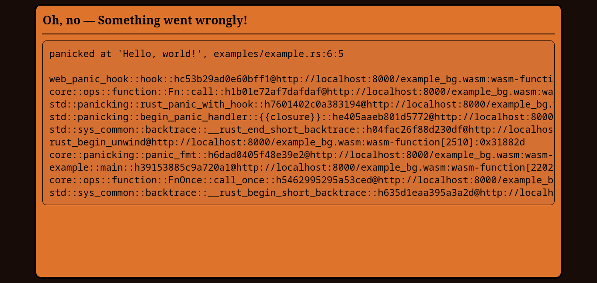

# Web Panic Hook

#### Panic handling in the browser (wasm)

[](https://crates.io/crates/web_panic_hook)
[](https://crates.io/crates/web_panic_hook)
[](https://crates.io/crates/web_panic_hook)  
[](https://github.com/AldaronLau/web_panic_hook/search?l=Text&q=license)
[](https://docs.rs/web_panic_hook/)



```bash
cargo install wasm-bindgen-cli
cargo install https
cargo run --example index
cargo build --example example --target wasm32-unknown-unknown
wasm-bindgen --out-dir html --target web --no-typescript --omit-default-module-path target/wasm32-unknown-unknown/debug/examples/example.wasm
http html/
```

## License
Copyright © 2023 The Web Panic Hook Contributors.

Licensed under any of
 - Apache License, Version 2.0, ([LICENSE\_APACHE] or
   <https://www.apache.org/licenses/LICENSE-2.0>)
 - Boost Software License, Version 1.0, ([LICENSE\_BOOST] or
   <https://www.boost.org/LICENSE_1_0.txt>)
 - MIT License, ([LICENSE\_MIT] or <https://mit-license.org/>)

at your option.

### Contribution
Unless you explicitly state otherwise, any contribution intentionally submitted
for inclusion in the work by you, as defined in the Apache-2.0 license, shall be
licensed as described above, without any additional terms or conditions.

## Help
If you want help using or contributing to this library, feel free to send me an
email at <aldaronlau@gmail.com>.

[LICENSE\_APACHE]: https://github.com/AldaronLau/web_panic_hook/blob/stable/LICENSE_APACHE
[LICENSE\_BOOST]: https://github.com/AldaronLau/web_panic_hook/blob/stable/LICENSE_BOOST
[LICENSE\_MIT]: https://github.com/AldaronLau/web_panic_hook/blob/stable/LICENSE_MIT
